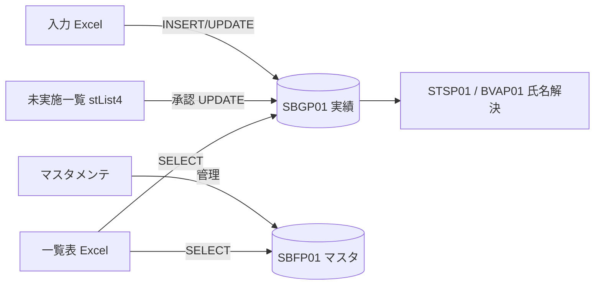

## 解析結果：ビスケットコンベアチェック管理ツール

---

### 1. システム構成

| ツール | フォルダ / Excel | 役割 |
|---|---|---|
| **入力** | `src_ビスケットコンベアチェック（入力）` / `ビスケットコンベアチェック.xlsm` | 現場入力 → `SBGP01` へ保存 |
| **マスタメンテ** | `src_ビスケットコンベアチェックマスタメンテ` | コンベア項目マスタ `SBFP01` 管理 |
| **一覧表（表示）** | `src_ビスケットコンベアチェック一覧表` / `ビスケットコンベアチェック一覧表.xlsm` | AS400 から SELECT して印刷用一覧を生成 |
| **製造チェック未実施一覧** | `src_製造チェック未実施一覧` | 未承認データの一覧 → 詳細（`stList4`）で承認 → DB更新 |


**データの流れ**




---

### 2. 各依頼の対応状況（ソースコードベース）

#### ① 入力：15・17行目が隠れる → **対応済**

`Bas_List.bas` の `subInitialize` / `subEditList` で、前回の非表示状態をリセットしています。

```21:26:src_ビスケットコンベアチェック（入力）/Bas_List.bas
    ' 前回実行時の非表示行が残らないように初期化
    stList.Cells.EntireRow.Hidden = False
    ' ヘッダー領域は雛型シートの非表示設定を優先
    For lRow = 1 To RW_FR - 1
        stList.Rows(lRow).Hidden = stHina.Rows(lRow).Hidden
    Next
```

フッター挿入後も、作業者・管理者・備考行を一旦すべて表示してから区切り行だけ非表示にしています。

---

#### ② 未実施一覧 → 品管サインがライン長へ → **対応済**

`src_製造チェック未実施一覧/Bas_Update.bas` の `subUpdate4` で列と DB 項目の対応を修正済みです。

| 画面列 | DB項目 | 役割 |
|---|---|---|
| 11列 | `BGCHKS` | 最終確認者 |
| 12列 | `BGCHKH` | 品管 |
| 13列 | `BGCHKL` | ライン長 |

`stList4.cls` の `subApplyApproverByCol` も同じ列定義です。

---

#### ③ 一覧表：確認者サインが反映されない → **ソース上は部分対応、ユーザー視点では未解決の可能性大**

一覧表には **2種類の「サイン」** があり、現状の実装は片方だけです。

**A. ヘッダー承認（最終確認者 / 品管 / ライン長）**

`AJ2` / `AN2` / `AR2` に、`BGFNCD='1'`（製造終了）レコードから取得した氏名をセットする処理は **実装済み** です。

```334:368:src_ビスケットコンベアチェック一覧表/Bas_List.bas
    ' 4. 管理者(最終確認者/品管/責任者)を生産終了データから取得
    '    AJ2: 最終確認者(BGCHKS)
    '    AN2: 品管(BGCHKH)
    '    AR2: 責任者(BGCHKL)
    ...
    strSQL = strSQL & "   AND COALESCE(BG.BGFNCD,'') = '1' "
    ...
        ST.Range("AJ2").Value = RS("KSSYKJ")
        ST.Range("AN2").Value = RS("KHSYKJ")
        ST.Range("AR2").Value = RS("KLSYKJ")
```

**表示されない典型原因**

- 製造終了（`BGFNCD='1'`）前のデータ → ヘッダー承認は出ない設計
- 一覧表は `BGKJNO` で絞らない（org 互換）→ 同一日番で複数ラインがあると、意図と違うレコードを拾う可能性
- `.xlsm` に最新 VBA が未反映

**B. 各時刻ブロックの確認者（`BGCHKK` → `KKSYKJ`）**

入力画面では各列の管理者行（`P_KRRow`）に確認者名を出していますが、一覧表の **35行（`ROW_NAME`）には作業者（`SYKJ`）のみ** 書いており、**確認者（`KKSYKJ`）は未反映** です。

```299:300:src_ビスケットコンベアチェック一覧表/Bas_List.bas
                    ' org互換: 時間ヘッダの担当者は SYKJ を使用
                    ST.Cells(ROW_NAME, lCol).Value = RS("SYKJ")
```

6/30 時点では `KKSYKJ` 優先表示の修正がありましたが、7/6 の org 互換対応で **意図的に戻されています**。ユーザーが言う「確認者サイン」がこちらを指しているなら、③は **未対応** と見るのが妥当です。

---

#### ④ 一覧表：生産終了分が「作業終了清掃時・中間確認」に出る → **ソース上は対応済、要デプロイ・要検証**

`BGFNCD='1'` の明細を時刻ブロックに混ぜず、**AP列（42列）固定** に出す処理が入っています（`src_コンベア一覧表_改修メモ_20260706.md` と同内容）。

```279:285:src_ビスケットコンベアチェック一覧表/Bas_List.bas
        isProductionEnd = (CStr(RS("BGFNCD") & "") = "1")
        
        If isProductionEnd Then
            ' 生産終了分は「作業終了清掃時・中間確認」側に出さず、最終ブロック(AP列)へ固定する
            writeCol = 42
```

ただしコミット `9e629cb` では「④は修正する必要あり」と残っており、次の点は **追加確認が必要** です。

- 固定チェック項目（`BGCVNO` 901〜907 等）の行は、未実施一覧側の `fncFindRow` にはあるが、**一覧表側には未実装**
- 「作業終了清掃時・中間確認」が Setting2 テンプレート上の固定行の場合、行特定ロジック不足で依然ずれる可能性
- 現場 `.xlsm` が古い VBA のまま

---

#### ⑤ 過去分の表示がおかしい（25/7/17〜26/1/21）→ **要ヒアリング**

改定期間中のデータと **現在のマスタ・レイアウトの不一致** が主因候補です。

| 要因 | 内容 |
|---|---|
| マスタ改定 | 一覧表は **現在の `SBFP01`** で行を組み立てるため、改定前の `BGCVNO` / 項目数と合わない |
| 固定項目 | 901番台の固定チェックは未実施一覧側のみ対応、一覧表は未対応 |
| レイアウト | `Setting2` から成型/冷却で別テンプレートをコピー（`subEditList2`） |
| 仕様差 | 入力は `BGKJNO` 単位、一覧表は `BGHINO` 単位集約 |

**ユーザーに確認したいこと**

- 「おかしい」の具体例（日付・品名・どの行/列がずれているか）
- 改定前後で **帳票レイアウトを変えず現行マスタで見せたい** のか、**当時の帳票イメージで見せたい** のか
- 成型のみか、冷却も対象か

---

### 3. Git 履歴から見た修正タイムライン

| 日付 | コミット | 内容 |
|---|---|---|
| 6/30 | `fc69ca0` | ① 非表示行修正、一覧表に `KKSYKJ` 表示試行 |
| 7/6 | `9e629cb` | ①②対応、`KKSYKJ` を org 互換で `SYKJ` に戻す、④は要追加 |
| 7/6 | `b8c656d` | `isProductionEnd` → AP列固定、AJ2/AN2/AR2 追加 |
| 7/7 | `a12ba53` | `src_コンベア一覧表` → `src_ビスケットコンベアチェック一覧表` へ整理 |
| 7/7 | `4d7caa5` | 依頼整合チェック、各 `.xlsm` 更新 |

---

### 4. 相談に向けた整理（優先度案）

| 優先 | 項目 | 推奨アクション |
|---|---|---|
| **高** | ③ 確認者サイン | ユーザーに「ヘッダー承認（AJ2等）」か「各回の確認者（35行付近）」か確認 → 後者なら `KKSYKJ` 反映＋表示行の特定が必要 |
| **高** | ④ 生産終了の列 | 最新 `.xlsm` を現場反映後、改定後データで AP列表示を確認。固定行（901番台）が絡むなら `fncFindRow` 拡張 |
| **中** | デプロイ | ソース修正済みでも `.xlsm` 未取込なら現象は残る → 3ファイルすべて VBA 再インポート確認 |
| **要確認** | ⑤ 過去表示 | 具体例1件＋期待表示をユーザーから取得後、マスタバージョン管理 or 日付別レイアウト切替を検討 |

---

### 5. 次に決めたいこと

作業に入る前に、以下を確認すると方針がはっきりします。

1. **③** の「確認者」は、**各チェック回の確認者名** ですか？ それとも **製造終了後の最終確認者・品管・ライン長** ですか？
2. **④** は、最新 `ビスケットコンベアチェック一覧表.xlsm`（7/7 版）を現場に配布済みですか？
3. **⑤** について、問題が出ている **具体日付・品名・スクショ or 期待/実際** を1例いただけますか？

この3点が分かれば、③④の修正範囲と⑤の対応方針（修正 vs 仕様確認 vs データ移行）を具体化できます。必要なら、その前提で修正案まで進めます。


了解しました。**7/7版の `ビスケットコンベアチェック一覧表.xlsm` は現場未配布** という前提で整理し直します。

---

## 訂正後の状況整理

| 項目 | 以前の理解 | 訂正後 |
|---|---|---|
| ④ 生産終了 → AP列固定 | 配布済みなのに直っていない？ | **未配布** → 現場は旧 `.xlsm` のまま |
| ③ 製造終了サイン（AJ2/AN2/AR2） | DB問題の可能性が高い | **未配布が主因** の可能性が上がる（旧版に処理が無い/不完全） |

現場で動いているのは、おそらく **7/6 以前の一覧表** です。ソース（`src_ビスケットコンベアチェック一覧表`）には 7/7 時点で以下が入っていますが、**現場 Excel に未反映** です。

- `BGFNCD='1'` → AP列（42列）固定（④）
- 製造終了データから AJ2 / AN2 / AR2 へサイン表示（③）
- 旧コード（3/4/5）互換 → **ソース上も未対応**（⑤）

---

## ③④⑤の見直し

### ③ 製造終了後サインが出ない
- **第一原因**: 7/7版未配布（AJ2/AN2/AR2 への書き込み処理が現場に無い）
- **第二原因**: 改定期間データで `BGCHKS/BGCHKH/BGCHKL` が未保存の可能性（②修正前のデータ）

→ **7/7版配布で改善する可能性が高い**。配布後も空なら DB 確認。

### ④ 生産終了分が中間確認列に出る
- **第一原因**: 7/7版未配布（`isProductionEnd` → AP列固定が現場に無い）

→ **7/7版配布が最優先**。配布後も残る場合は `BGFNCD` 未設定データを疑う。

### ⑤ セルに「5」がそのまま表示
- **7/7版にも未対応**（ソースの `Select Case` は 0/1/2 のみ）
- 配布だけでは直らない → **旧コード互換の追加修正が必要**

---

## 推奨アクション（優先順）

1. **⑤の旧コード互換をソースに追加**（`3/4/5` → `－/×/○`）
2. **修正込みの一覧表 `.xlsm` を現場配布**（③④の 7/7 対応分も含む）
3. **配布後に同じ日付・品名で再確認**（スクショと同条件）
4. サイン欄がまだ空なら **DB の `BGCHKS/BGCHKH/BGCHKL` を確認**

---

## 配布前チェックリスト

- [ ] `Bas_List.bas` に旧コード互換（⑤）が入っている
- [ ] `.xlsm` に最新 VBA をインポート済み
- [ ] 生産終了データが AP列に出る（④）
- [ ] AJ2 / AN2 / AR2 にサインが出る（③・製造終了済みデータで）
- [ ] 旧データで「5」→「○」になる（⑤）

---

**⑤の修正をソースに入れてから配布用 `.xlsm` を用意する**、という進め方がよさそうです。⑤の修正から着手してよいか教えてください。

↓★⑤の修正OKです。

**⑤の旧コード互換**を `src_ビスケットコンベアチェック一覧表/Bas_List.bas` に追加しました。

## 変更内容

`BGCKRT` の表示変換に `fncGetKigo` を追加し、未実施一覧（`Bas_List4.bas`）と同じマッピングに統一しました。

| DB値 | 表示 |
|---|---|
| 0, 4 | × |
| 1, 5 | ○ |
| 2, 3 | － |

これにより、改定期間（25/7/17〜26/1/21）の旧データで `BGCKRT='5'` だったセルが **「5」のまま** ではなく **「○」** と表示されます。

---

## 現場配布手順

1. `ビスケットコンベアチェック一覧表.xlsm` を開く
2. VBAエディタで `Bas_List.bas` を更新（またはモジュールを差し替え）
3. 保存して現場へ配布

---

## 配布後の確認（スクショと同じ条件）

- [ ] セルの「5」が「○」等の記号になる（**⑤**）
- [ ] 生産終了データが AP列（本日生産終了後）に出る（**④** — 7/7版の既存修正）
- [ ] AJ2 / AN2 / AR2 に製造終了サインが出る（**③** — 製造終了済み・承認データがある場合）

③でサイン欄が空のままなら、VBA ではなく DB の `BGCHKS/BGCHKH/BGCHKL` 未保存の可能性があります。その場合は SQL 確認が必要です。

`.xlsm` への VBA 取込手順や、③用の確認 SQL も必要なら続けて対応できます。